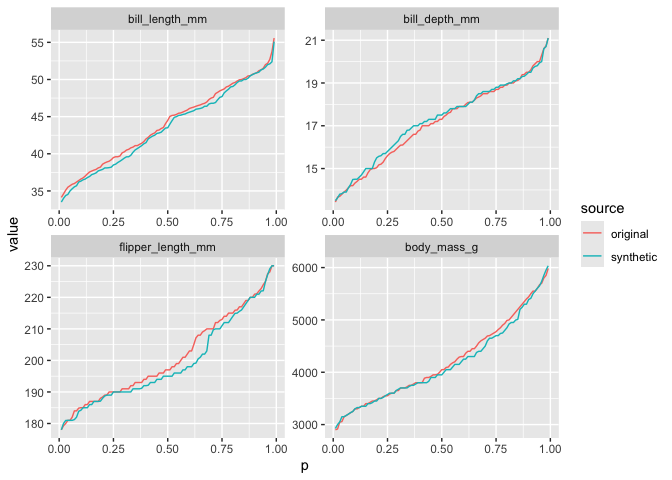
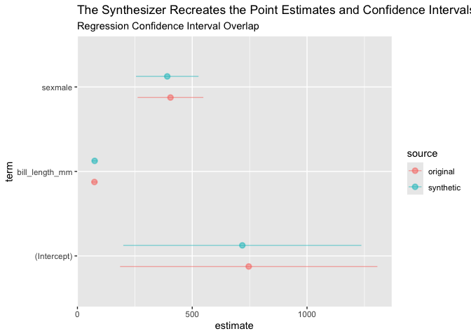
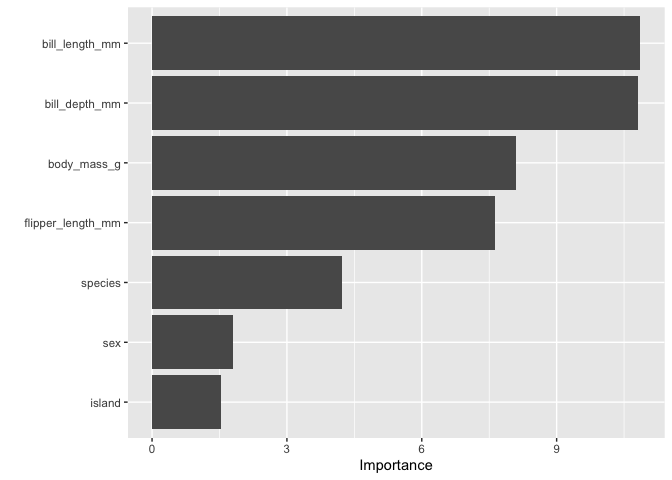
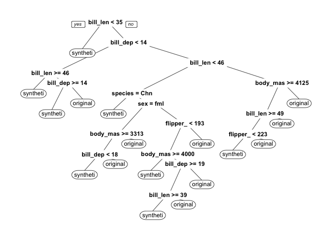
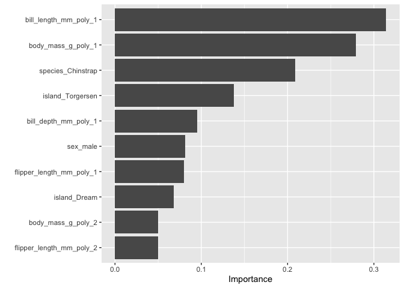

# `syntheval`

<!-- badges: start -->

<!-- badges: end -->

`syntheval` makes it simple to evaluate the utility and disclosure risks
of synthetic data. The package is designed to work any `data.frame`
objects or `postsynth` objects from `tidysynthesis`.

# Package Status and Documentation

This package is still under active development before we release our
first major version, 0.1.0. This will involve API changes and new
functionality. You can keep track of our work in the following issues:

- [Version 0.0.5](https://github.com/UrbanInstitute/syntheval/issues/77)
- [Version 0.0.6](https://github.com/UrbanInstitute/syntheval/issues/78)
- [Version
  0.1.0](https://github.com/UrbanInstitute/syntheval/issues/107)

For detailed documentation, you can see our [documentation
website](https://ui-research.github.io/tidysynthesis-documentation/).

**Note:** `library(tidysynthesis)` is currently under private
development but will be made public in Q1 of 2025.

## Navigation

- [Installation](#installation)
- [Utility Metrics](#utility-metrics)
  - [Proportions](#proportions)
  - [Means and totals](#means-and-totals)
  - [Percentiles](#percentiles)
  - [KS Distance](#ks-distance)
  - [Co-Occurrence](#co-occurrence)
  - [Correlations](#correlations)
  - [Coefficient overlap](#coefficient-overlap)
  - [Discriminant-based metrics](#discriminant-based-metrics)
- [Additional Functionality](#additional-functionality)
  - [Grouping](#grouping)
  - [Weighting](#weighting)

## Installation

``` r
install.packages("remotes")
remotes::install_github("UrbanInstitute/syntheval")
```

## Utility Metrics

``` r
library(tidyverse)
library(syntheval)
```

### Setup

The following examples demonstrate utility and disclosure risk metrics
using synthetic data based on the [Palmer
Penguins](https://allisonhorst.github.io/palmerpenguins/) dataset.
`library(syntheval)` contains three built-in data sets:

- `penguins_conf`: Pre-processed `penguins` data that were passed into
  the synthesizer.
- `penguins_postsynth`: A `postsynth` object synthesized from `penguins`
  using `library(tidysynthesis)`.
- `penguins_syn_df`: A data frame pulled from `penguins_postsynth`. This
  is used to demonstrate how `library(syntheval)` works with output from
  a synthesizer different than `library(tidysynthesis)`.

Functions like `util_proportions()` and `util_moments()` have different
behaviors for `postsynth` objects and data frames. By default, they only
show synthesized variables for `postsynth` objects and show all common
variables for data frames. The `common_vars` and `synth_vars` arguments
can change this behavior.

### Evaluation Data

`syntheval` functions expect `eval_data` as their main input object.

``` r
eval_data <- eval_data(conf_data = penguins_conf, synth_data = penguins_postsynth)
```

### Proportions

`util_proportions()` compares the proportions of classes from
categorical variables in the original data and synthetic data.

``` r
util_proportions(eval_data = eval_data)
```

    # A tibble: 2 × 5
      variable class  synthetic original difference
      <chr>    <fct>      <dbl>    <dbl>      <dbl>
    1 sex      female     0.529    0.495     0.0330
    2 sex      male       0.471    0.505    -0.0330

All common variables are shown when using a data frame.

``` r
util_proportions(eval_data = eval_data)
```

    # A tibble: 2 × 5
      variable class  synthetic original difference
      <chr>    <fct>      <dbl>    <dbl>      <dbl>
    1 sex      female     0.529    0.495     0.0330
    2 sex      male       0.471    0.505    -0.0330

### Means and Totals

`util_moments()` compares the counts, means, standard deviations,
skewnesses, and kurtoses of the original data and synthetic data.

``` r
util_moments(eval_data = eval_data)
```

    # A tibble: 20 × 6
       variable        statistic original synthetic difference proportion_difference
       <fct>           <fct>        <dbl>     <dbl>      <dbl>                 <dbl>
     1 bill_length_mm  count      3.33e+2  333          0                    0      
     2 bill_length_mm  mean       4.40e+1   43.5       -0.502               -0.0114 
     3 bill_length_mm  sd         5.47e+0    5.54       0.0723               0.0132 
     4 bill_length_mm  skewness   4.51e-2    0.0646     0.0195               0.432  
     5 bill_length_mm  kurtosis  -8.88e-1   -0.948     -0.0598               0.0674 
     6 bill_depth_mm   count      3.33e+2  333          0                    0      
     7 bill_depth_mm   mean       1.72e+1   17.3        0.122                0.00712
     8 bill_depth_mm   sd         1.97e+0    1.89      -0.0762              -0.0387 
     9 bill_depth_mm   skewness  -1.49e-1   -0.278     -0.129                0.867  
    10 bill_depth_mm   kurtosis  -8.97e-1   -0.742      0.155               -0.172  
    11 flipper_length… count      3.33e+2  333          0                    0      
    12 flipper_length… mean       2.01e+2  199.        -1.70                -0.00847
    13 flipper_length… sd         1.40e+1   13.9       -0.135               -0.00961
    14 flipper_length… skewness   3.59e-1    0.611      0.253                0.705  
    15 flipper_length… kurtosis  -9.65e-1   -0.704      0.261               -0.270  
    16 body_mass_g     count      3.33e+2  333          0                    0      
    17 body_mass_g     mean       4.21e+3 4162.       -45.0                 -0.0107 
    18 body_mass_g     sd         8.05e+2  783.       -22.3                 -0.0277 
    19 body_mass_g     skewness   4.70e-1    0.655      0.185                0.394  
    20 body_mass_g     kurtosis  -7.40e-1   -0.388      0.353               -0.477  

`util_totals()` is similar to `util_moments()` but looks at counts and
totals.

``` r
util_totals(eval_data = eval_data)
```

    # A tibble: 8 × 6
      variable         statistic original synthetic difference proportion_difference
      <fct>            <fct>        <dbl>     <dbl>      <dbl>                 <dbl>
    1 bill_length_mm   count         333       333         0                 0      
    2 bill_length_mm   total       14650.    14483.     -167.               -0.0114 
    3 bill_depth_mm    count         333       333         0                 0      
    4 bill_depth_mm    total        5716.     5757.       40.7               0.00712
    5 flipper_length_… count         333       333         0                 0      
    6 flipper_length_… total       66922     66355      -567                -0.00847
    7 body_mass_g      count         333       333         0                 0      
    8 body_mass_g      total     1400950   1385950    -15000                -0.0107 

### Percentiles

`util_percentiles()` compares percentiles from the original data and
synthetic data. The default percentiles are `c(0.1, 0.5, 0.9)` and can
be easily overwritten.

``` r
util_percentiles(
  eval_data = eval_data,
  probs = c(0.5, 0.8)
)
```

    # A tibble: 8 × 6
          p variable          original synthetic difference proportion_difference
      <dbl> <fct>                <dbl>     <dbl>      <dbl>                 <dbl>
    1   0.5 bill_length_mm        44.5      43.5    -1                   -0.0225 
    2   0.8 bill_length_mm        49.5      49.1    -0.440               -0.00889
    3   0.5 bill_depth_mm         17.3      17.5     0.200                0.0116 
    4   0.8 bill_depth_mm         18.9      19.0     0.0600               0.00317
    5   0.5 flipper_length_mm    197       195      -2                   -0.0102 
    6   0.8 flipper_length_mm    215       214      -1                   -0.00465
    7   0.5 body_mass_g         4050      3950    -100                   -0.0247 
    8   0.8 body_mass_g         4990      4850    -140                   -0.0281 

The functions are designed to work well with `library(ggplot2)`.

``` r
util_percentiles(
  eval_data = eval_data,
  probs = seq(0.01, 0.99, 0.01)
) |>
  pivot_longer(
    cols = c(original, synthetic),
    names_to = "source",
    values_to = "value"
  ) |>
  ggplot(aes(x = p, y = value, color = source)) +
  geom_line() +
  facet_wrap(~ variable, scales = "free")
```



### KS Distance

`util_ks_distance()` shows the Kolmogorov-Smirnov distance between the
original distribution and synthetic distribution for numeric variables.
The function also returns the point(s) of the maximum distance.

``` r
util_ks_distance(eval_data = eval_data)
```

    # A tibble: 14 × 3
       variable           value      D
       <chr>              <dbl>  <dbl>
     1 bill_length_mm      38.7 0.0601
     2 bill_depth_mm       16.7 0.0511
     3 bill_depth_mm       16.7 0.0511
     4 bill_depth_mm       16.8 0.0511
     5 bill_depth_mm       16.8 0.0511
     6 flipper_length_mm  196.  0.0781
     7 flipper_length_mm  196.  0.0781
     8 flipper_length_mm  197.  0.0781
     9 flipper_length_mm  197.  0.0781
    10 flipper_length_mm  197.  0.0781
    11 body_mass_g       4359.  0.0480
    12 body_mass_g       4370.  0.0480
    13 body_mass_g       4381.  0.0480
    14 body_mass_g       4392.  0.0480

### Co-Occurrence

`util_co_occurrence()` differences the lower triangles of co-occurrence
matrices calculated on numeric variables in the original data and
synthetic data.

``` r
co_occurrence <- util_co_occurrence(eval_data = eval_data)

co_occurrence$co_occurrence_difference
```

                      bill_length_mm bill_depth_mm flipper_length_mm body_mass_g
    bill_length_mm                NA            NA                NA          NA
    bill_depth_mm                  0            NA                NA          NA
    flipper_length_mm              0             0                NA          NA
    body_mass_g                    0             0                 0          NA

The function returns the MAE for co-occurrences, which provides a sense
of the median error between the original and synthetic data. The
function also returns the RMSE for co-occurrences, which provides a
sense of the average error between the original data and synthetic data.

``` r
co_occurrence$co_occurrence_difference_mae
```

    [1] 0

``` r
co_occurrence$co_occurrence_difference_rmse
```

    [1] 0

All observations have non-zero `bill_length_mm`, `bill_depth_mm`,
`flipper_length_mm`, and `body_mass_g`. `util_co_occurrence()` is most
useful for economic variables like income and wealth where `0` is a
common value.

### Correlations

`util_corr_fit()` differences the lower triangles of correlation
matrices calculated on numeric variables in the original data and
synthetic data.

``` r
corr_fit <- util_corr_fit(eval_data = eval_data)

round(corr_fit$correlation_difference, digits = 3)
```

                      bill_length_mm bill_depth_mm flipper_length_mm body_mass_g
    bill_length_mm                NA            NA                NA          NA
    bill_depth_mm             -0.069            NA                NA          NA
    flipper_length_mm         -0.003        -0.048                NA          NA
    body_mass_g                0.031        -0.011             -0.08          NA

The function returns the MAE for correlation coefficients, which
provides a sense of the median error between the original and synthetic
data. The function also returns the RMSE for the correlation
coefficients, which provides a sense of the average error between the
original synthetic data.

``` r
corr_fit$correlation_difference_mae
```

    [1] 0.04034565

``` r
corr_fit$correlation_difference_rmse
```

    [1] 0.04922324

### Coefficient Overlap

`util_ci_overlap()` compares a linear regression models estimated on the
original data and synthetic data. `formula` specifies the functional
form of the regression model.

``` r
ci_overlap <- util_ci_overlap(
  eval_data = eval_data,
  formula = body_mass_g ~ bill_length_mm  + sex
)
```

`$ci_overlap()` summarizes each coefficient including how much the
confidence intervals overlap, if the signs match, and if the statistical
significance matches.

``` r
ci_overlap$ci_overlap 
```

    # A tibble: 3 × 8
      term    overlap coef_diff std_coef_diff sign_match significance_match ss_match
      <chr>     <dbl>     <dbl>         <dbl> <lgl>      <lgl>              <lgl>   
    1 (Inter…   0.963   -27.8         -0.0978 TRUE       TRUE               TRUE    
    2 bill_l…   0.965     0.917        0.138  TRUE       TRUE               TRUE    
    3 sexmale   0.951   -14.0         -0.192  TRUE       TRUE               TRUE    
    # ℹ 1 more variable: sso_match <lgl>

`$coefficient` provides detail for each coefficient and is useful for
data visualization.

``` r
ci_overlap$coefficient
```

    # A tibble: 6 × 8
      source    term        estimate std.error statistic  p.value conf.low conf.high
      <chr>     <chr>          <dbl>     <dbl>     <dbl>    <dbl>    <dbl>     <dbl>
    1 original  (Intercept)    746.     285.        2.62 9.22e- 3    186.     1306. 
    2 original  bill_lengt…     74.0      6.67     11.1  1.51e-24     60.9      87.1
    3 original  sexmale        405.      72.8       5.57 5.43e- 8    262.      548. 
    4 synthetic (Intercept)    718.     264.        2.72 6.77e- 3    200.     1237. 
    5 synthetic bill_lengt…     74.9      6.25     12.0  8.98e-28     62.7      87.2
    6 synthetic sexmale        391.      69.2       5.65 3.42e- 8    255.      527. 

``` r
ci_overlap$coefficient |>
  ggplot(aes(x = estimate, xmin = conf.low, xmax = conf.high, y = term, color = source)) +
  geom_pointrange(alpha = 0.5, position = position_dodge(width = 0.5)) +
  labs(
    title = "The Synthesizer Recreates the Point Estimates and Confidence Intervals",
    subtitle = "Regression Confidence Interval Overlap"
  )
```



### Discriminant-Based Metrics

Discriminant-based metrics build models to predict if an observation is
original or synthetic and then evaluate those model predictions.
Ideally, it should be difficult for a model to distinguish, or
discriminate, between original observations and synthetic observations.

- Any classification model that generates probabilities from
  `library(tidymodels)` can be used to generate propensities (the
  estimated probability than observation is synthetic).
- By default, the code creates a training/testing split and returns
  separate metrics for each split. This can be turned off with
  `split = FALSE`.
- The code can handle hyperparameter tuning.
- After calculating propensities, the code can calculate ROC AUC,
  SPECKS, pMSE, and pMSE ratio.

#### Example Using Decision Trees

Discriminant-based metrics are built a `discrimination` object created
by `discrimination()`.

``` r
disc1 <- discrimination(eval_data = eval_data)
```

Next, we use `library(tidymodels)` to specify a model. We recommend the
[tidymodels tutorial](https://www.tidymodels.org/start/) to learn more.

``` r
library(tidymodels)

rpart_rec <- recipe(
  .source_label ~ ., 
  data = disc1$combined_data
)

rpart_mod <- decision_tree(cost_complexity = 0.01) |>
  set_mode(mode = "classification") |>
  set_engine(engine = "rpart")
```

Next, we fit the model to the data to generate predicted probabilities.

``` r
disc1 <- disc1 |>
  add_propensities(
    recipe = rpart_rec,
    spec = rpart_mod
  ) 
```

At this point, we can use

- `add_discriminator_auc()` to add the ROC AUC for the predicted
  probabilities
- `add_specks()` to add SPECKS for the predicted probabilities
- `add_pmse()` to add pMSE for the predicted probabilities
- `add_pmse_ratio(times = 25)` to add the pMSE ratio using the pMSE
  model and 25 bootstrap samples

``` r
disc1 |>
  add_discriminator_auc() |>
  add_specks() |>
  add_pmse() |>
  add_pmse_ratio(times = 25)
```

    $combined_data
    # A tibble: 666 × 8
       .source_label species island    sex    bill_length_mm bill_depth_mm
       <fct>         <fct>   <fct>     <fct>           <dbl>         <dbl>
     1 original      Adelie  Torgersen male             39.1          18.7
     2 original      Adelie  Torgersen female           39.5          17.4
     3 original      Adelie  Torgersen female           40.3          18  
     4 original      Adelie  Torgersen female           36.7          19.3
     5 original      Adelie  Torgersen male             39.3          20.6
     6 original      Adelie  Torgersen female           38.9          17.8
     7 original      Adelie  Torgersen male             39.2          19.6
     8 original      Adelie  Torgersen female           41.1          17.6
     9 original      Adelie  Torgersen male             38.6          21.2
    10 original      Adelie  Torgersen male             34.6          21.1
    # ℹ 656 more rows
    # ℹ 2 more variables: flipper_length_mm <dbl>, body_mass_g <dbl>

    $propensities
    # A tibble: 666 × 10
       .pred_synthetic .source_label .sample  species island    sex   bill_length_mm
                 <dbl> <fct>         <chr>    <fct>   <fct>     <fct>          <dbl>
     1           0.143 original      training Adelie  Torgersen male            39.1
     2           0.627 original      testing  Adelie  Torgersen fema…           39.5
     3           0.378 original      training Adelie  Torgersen fema…           40.3
     4           0.429 original      training Adelie  Torgersen fema…           36.7
     5           0.733 original      testing  Adelie  Torgersen male            39.3
     6           0.627 original      training Adelie  Torgersen fema…           38.9
     7           0.327 original      training Adelie  Torgersen male            39.2
     8           0.378 original      training Adelie  Torgersen fema…           41.1
     9           0.25  original      training Adelie  Torgersen male            38.6
    10           0.327 original      training Adelie  Torgersen male            34.6
    # ℹ 656 more rows
    # ℹ 3 more variables: bill_depth_mm <dbl>, flipper_length_mm <dbl>,
    #   body_mass_g <dbl>

    $discriminator
    ══ Workflow [trained] ══════════════════════════════════════════════════════════
    Preprocessor: Recipe
    Model: decision_tree()

    ── Preprocessor ────────────────────────────────────────────────────────────────
    0 Recipe Steps

    ── Model ───────────────────────────────────────────────────────────────────────
    n= 498 

    node), split, n, loss, yval, (yprob)
          * denotes terminal node

      1) root 498 249 synthetic (0.5000000 0.5000000)  
        2) bill_length_mm< 34.55 17   5 synthetic (0.7058824 0.2941176) *
        3) bill_length_mm>=34.55 481 237 original (0.4927235 0.5072765)  
          6) bill_depth_mm< 14.05 33  13 synthetic (0.6060606 0.3939394)  
           12) bill_length_mm>=46.15 8   1 synthetic (0.8750000 0.1250000) *
           13) bill_length_mm< 46.15 25  12 synthetic (0.5200000 0.4800000)  
             26) bill_depth_mm>=13.85 10   2 synthetic (0.8000000 0.2000000) *
             27) bill_depth_mm< 13.85 15   5 original (0.3333333 0.6666667) *
          7) bill_depth_mm>=14.05 448 217 original (0.4843750 0.5156250)  
           14) bill_length_mm< 46.45 289 141 synthetic (0.5121107 0.4878893)  
             28) species=Chinstrap 45  15 synthetic (0.6666667 0.3333333) *
             29) species=Adelie,Gentoo 244 118 original (0.4836066 0.5163934)  
               58) sex=female 133  63 synthetic (0.5263158 0.4736842)  
                116) body_mass_g>=3312.5 96  40 synthetic (0.5833333 0.4166667)  
                  232) bill_depth_mm< 17.95 75  28 synthetic (0.6266667 0.3733333) *
                  233) bill_depth_mm>=17.95 21   9 original (0.4285714 0.5714286) *
                117) body_mass_g< 3312.5 37  14 original (0.3783784 0.6216216) *
               59) sex=male 111  48 original (0.4324324 0.5675676)  
                118) flipper_length_mm< 192.5 62  30 synthetic (0.5161290 0.4838710)  
                  236) body_mass_g>=4000 25   8 synthetic (0.6800000 0.3200000) *
                  237) body_mass_g< 4000 37  15 original (0.4054054 0.5945946)  
                    474) bill_depth_mm>=18.8 23  10 synthetic (0.5652174 0.4347826)  
                      948) bill_length_mm>=39 15   4 synthetic (0.7333333 0.2666667) *
                      949) bill_length_mm< 39 8   2 original (0.2500000 0.7500000) *
                    475) bill_depth_mm< 18.8 14   2 original (0.1428571 0.8571429) *
                119) flipper_length_mm>=192.5 49  16 original (0.3265306 0.6734694) *
           15) bill_length_mm>=46.45 159  69 original (0.4339623 0.5660377)  
             30) body_mass_g>=4125 108  51 original (0.4722222 0.5277778)  
               60) bill_length_mm>=49.25 61  27 synthetic (0.5573770 0.4426230)  
                120) flipper_length_mm< 222.5 42  14 synthetic (0.6666667 0.3333333) *
                121) flipper_length_mm>=222.5 19   6 original (0.3157895 0.6842105) *
               61) bill_length_mm< 49.25 47  17 original (0.3617021 0.6382979) *
             31) body_mass_g< 4125 51  18 original (0.3529412 0.6470588) *

    $discriminator_auc
    # A tibble: 2 × 4
      .sample  .metric .estimator .estimate
      <fct>    <chr>   <chr>          <dbl>
    1 training roc_auc binary         0.693
    2 testing  roc_auc binary         0.568

    $pmse
    # A tibble: 2 × 4
      .source   .pmse .null_pmse .pmse_ratio
      <fct>     <dbl>      <dbl>       <dbl>
    1 training 0.0311     0.0315       0.987
    2 testing  0.0314     0.0329       0.953

    $specks
    # A tibble: 2 × 2
      .source  .specks
      <fct>      <dbl>
    1 training   0.333
    2 testing    0.131

    attr(,"class")
    [1] "discrimination"

Finally, we can look at variable importance and the decision tree from
our discriminator.

``` r
library(vip)
library(rpart.plot)

disc1$discriminator |> 
  extract_fit_parsnip() |> 
  vip()
```



``` r
disc1$discriminator$fit$fit$fit |>
  prp()
```

    Warning: Cannot retrieve the data used to build the model (so cannot determine roundint and is.binary for the variables).
    To silence this warning:
        Call prp with roundint=FALSE,
        or rebuild the rpart model with model=TRUE.



#### Example Using Regularized Regression

Let’s repeat the workflow from above with LASSO logistic regression and
hyperparameter tuning.

``` r
# create discrimination
disc2 <- discrimination(eval_data = eval_data)

# create a recipe that includes 2nd-degree polynomials, dummy variables, and
# standardization
lasso_rec <- recipe(
  .source_label ~ ., 
  data = disc2$combined_data
) |>
  step_poly(all_numeric_predictors(), degree = 2) |>
  step_dummy(all_nominal_predictors()) |>
  step_normalize(all_predictors())

# create the model
lasso_mod <- logistic_reg(
  penalty = tune(), 
  mixture = 1
) |>
  set_engine(engine = "glmnet") |>
  set_mode(mode = "classification")

# create a tuning grid
lasso_grid <- grid_regular(penalty(), levels = 10)

# add the propensities
disc2 <- disc2 |>
  add_propensities_tuned(
    recipe = lasso_rec,
    spec = lasso_mod,
    grid = lasso_grid
  ) 

# calculate metrics
disc2 |>
  add_discriminator_auc() |>
  add_specks() |>
  add_pmse() |>
  add_pmse_ratio(times = 25)
```

    $combined_data
    # A tibble: 666 × 8
       .source_label species island    sex    bill_length_mm bill_depth_mm
       <fct>         <fct>   <fct>     <fct>           <dbl>         <dbl>
     1 original      Adelie  Torgersen male             39.1          18.7
     2 original      Adelie  Torgersen female           39.5          17.4
     3 original      Adelie  Torgersen female           40.3          18  
     4 original      Adelie  Torgersen female           36.7          19.3
     5 original      Adelie  Torgersen male             39.3          20.6
     6 original      Adelie  Torgersen female           38.9          17.8
     7 original      Adelie  Torgersen male             39.2          19.6
     8 original      Adelie  Torgersen female           41.1          17.6
     9 original      Adelie  Torgersen male             38.6          21.2
    10 original      Adelie  Torgersen male             34.6          21.1
    # ℹ 656 more rows
    # ℹ 2 more variables: flipper_length_mm <dbl>, body_mass_g <dbl>

    $propensities
    # A tibble: 666 × 10
       .pred_synthetic .source_label .sample  species island    sex   bill_length_mm
                 <dbl> <fct>         <chr>    <fct>   <fct>     <fct>          <dbl>
     1             0.5 original      training Adelie  Torgersen male            39.1
     2             0.5 original      training Adelie  Torgersen fema…           39.5
     3             0.5 original      training Adelie  Torgersen fema…           40.3
     4             0.5 original      training Adelie  Torgersen fema…           36.7
     5             0.5 original      training Adelie  Torgersen male            39.3
     6             0.5 original      training Adelie  Torgersen fema…           38.9
     7             0.5 original      training Adelie  Torgersen male            39.2
     8             0.5 original      training Adelie  Torgersen fema…           41.1
     9             0.5 original      training Adelie  Torgersen male            38.6
    10             0.5 original      testing  Adelie  Torgersen male            34.6
    # ℹ 656 more rows
    # ℹ 3 more variables: bill_depth_mm <dbl>, flipper_length_mm <dbl>,
    #   body_mass_g <dbl>

    $discriminator
    ══ Workflow [trained] ══════════════════════════════════════════════════════════
    Preprocessor: Recipe
    Model: logistic_reg()

    ── Preprocessor ────────────────────────────────────────────────────────────────
    3 Recipe Steps

    • step_poly()
    • step_dummy()
    • step_normalize()

    ── Model ───────────────────────────────────────────────────────────────────────

    Call:  glmnet::glmnet(x = maybe_matrix(x), y = y, family = "binomial",      alpha = ~1) 

       Df %Dev    Lambda
    1   0 0.00 0.0313500
    2   2 0.05 0.0285600
    3   2 0.10 0.0260300
    4   2 0.14 0.0237100
    5   3 0.18 0.0216100
    6   3 0.25 0.0196900
    7   3 0.32 0.0179400
    8   3 0.37 0.0163500
    9   3 0.42 0.0148900
    10  3 0.45 0.0135700
    11  3 0.48 0.0123600
    12  3 0.51 0.0112700
    13  4 0.53 0.0102700
    14  6 0.57 0.0093530
    15  6 0.61 0.0085230
    16  6 0.63 0.0077650
    17  7 0.66 0.0070760
    18  8 0.69 0.0064470
    19  9 0.76 0.0058740
    20  9 0.81 0.0053520
    21  9 0.85 0.0048770
    22  9 0.89 0.0044440
    23 10 0.92 0.0040490
    24 10 0.96 0.0036890
    25 10 0.98 0.0033610
    26 10 1.01 0.0030630
    27 11 1.03 0.0027910
    28 11 1.05 0.0025430
    29 11 1.07 0.0023170
    30 11 1.09 0.0021110
    31 11 1.10 0.0019240
    32 11 1.11 0.0017530
    33 12 1.12 0.0015970
    34 12 1.13 0.0014550
    35 12 1.13 0.0013260
    36 12 1.14 0.0012080
    37 12 1.14 0.0011010
    38 12 1.15 0.0010030
    39 12 1.15 0.0009138
    40 12 1.15 0.0008327
    41 12 1.15 0.0007587
    42 12 1.16 0.0006913
    43 12 1.16 0.0006299
    44 12 1.16 0.0005739
    45 12 1.16 0.0005229
    46 12 1.16 0.0004765

    ...
    and 0 more lines.

    $discriminator_auc
    # A tibble: 2 × 4
      .sample  .metric .estimator .estimate
      <fct>    <chr>   <chr>          <dbl>
    1 training roc_auc binary           0.5
    2 testing  roc_auc binary           0.5

    $pmse
    # A tibble: 2 × 4
      .source     .pmse .null_pmse .pmse_ratio
      <fct>       <dbl>      <dbl>       <dbl>
    1 training 1.23e-32   1.23e-32           1
    2 testing  1.23e-32   1.23e-32           1

    $specks
    # A tibble: 2 × 2
      .source   .specks
      <fct>       <dbl>
    1 training 4.86e-17
    2 testing  6.94e-17

    attr(,"class")
    [1] "discrimination"

``` r
# look at variable importance
library(vip)

disc2$discriminator |> 
  extract_fit_parsnip() |> 
  vip()
```



## Additional Functionality

### Grouping

Many utility metrics include a `group_by` argument to group the metrics
by group during calculation. For example, this code calculates moments
by species.

``` r
util_moments(
  eval_data = eval_data,
  group_by = species
)
```

    # A tibble: 60 × 7
       species   variable       statistic original synthetic difference
       <fct>     <fct>          <fct>        <dbl>     <dbl>      <dbl>
     1 Adelie    bill_length_mm count      146       153          7    
     2 Chinstrap bill_length_mm count       68        78         10    
     3 Gentoo    bill_length_mm count      119       102        -17    
     4 Adelie    bill_length_mm mean        38.8      38.5       -0.294
     5 Chinstrap bill_length_mm mean        48.8      47.3       -1.56 
     6 Gentoo    bill_length_mm mean        47.6      48.0        0.475
     7 Adelie    bill_length_mm sd           2.66      2.93       0.267
     8 Chinstrap bill_length_mm sd           3.34      3.07      -0.273
     9 Gentoo    bill_length_mm sd           3.11      3.40       0.299
    10 Adelie    bill_length_mm skewness     0.156     0.505      0.349
    # ℹ 50 more rows
    # ℹ 1 more variable: proportion_difference <dbl>

### Weighting

Many utility metrics include a `weight_var` argument to use weighted
statistics during calculation. For example, this code weights the
moments by the body weight of the penguins.

``` r
util_moments(
  eval_data = eval_data,
  weight_var = body_mass_g
)
```

    # A tibble: 20 × 6
       variable        statistic original synthetic difference proportion_difference
       <fct>           <fct>        <dbl>     <dbl>      <dbl>                 <dbl>
     1 bill_length_mm  count      1.40e+6   1.39e+6   -1.5 e+4              -0.0107 
     2 bill_length_mm  mean       4.46e+1   4.41e+1   -4.71e-1              -0.0106 
     3 bill_length_mm  sd         5.38e+0   5.54e+0    1.60e-1               0.0297 
     4 bill_length_mm  skewness  -7.39e-2  -5.74e-2    1.64e-2              -0.222  
     5 bill_length_mm  kurtosis  -7.89e-1  -9.15e-1   -1.26e-1               0.160  
     6 bill_depth_mm   count      1.40e+6   1.39e+6   -1.5 e+4              -0.0107 
     7 bill_depth_mm   mean       1.70e+1   1.71e+1    1.28e-1               0.00754
     8 bill_depth_mm   sd         2.01e+0   1.94e+0   -7.07e-2              -0.0351 
     9 bill_depth_mm   skewness   1.05e-2  -1.37e-1   -1.47e-1             -14.0    
    10 bill_depth_mm   kurtosis  -1.00e+0  -9.17e-1    8.70e-2              -0.0867 
    11 flipper_length… count      1.40e+6   1.39e+6   -1.5 e+4              -0.0107 
    12 flipper_length… mean       2.03e+2   2.01e+2   -1.97e+0              -0.00970
    13 flipper_length… sd         1.44e+1   1.46e+1    1.60e-1               0.0111 
    14 flipper_length… skewness   1.48e-1   3.99e-1    2.51e-1               1.70   
    15 flipper_length… kurtosis  -1.14e+0  -1.04e+0    1.08e-1              -0.0940 
    16 body_mass_g     count      1.40e+6   1.39e+6   -1.5 e+4              -0.0107 
    17 body_mass_g     mean       4.36e+3   4.31e+3   -5.19e+1              -0.0119 
    18 body_mass_g     sd         8.26e+2   8.17e+2   -9.84e+0              -0.0119 
    19 body_mass_g     skewness   2.69e-1   4.64e-1    1.95e-1               0.724  
    20 body_mass_g     kurtosis  -9.70e-1  -7.26e-1    2.44e-1              -0.251  

Most commonly, `weight_var` is used when synthesizing data from surveys.

## Getting Help

Contact <a href="mailto:awilliams@urban.org">Aaron R. Williams</a> with
feedback or questions.
